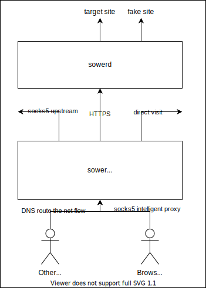

# sower

[](https://github.com/wweir/sower/releases)
[](https://github.com/wweir/sower/actions)
[](https://github.com/wweir/sower/issues)
[](https://github.com/wweir/sower/stargazers)
[](LICENSE)

中文介绍见 [Wiki](https://github.com/wweir/sower/wiki)

Sower is a cross-platform intelligent transparent proxy tool. It provides both socks5 proxy and DNS-based proxy. All these kinds of proxies support intelligent routing.

If you already have another proxy solution, you can use its socks5(h) service as a parent proxy to enjoy sower's intelligent routing.

## Installation

To enjoy sower, you need to deploy sower on both server-side(sowerd) and client-side(sower).

## Sowerd

_If you want to use sower as a secondary proxy to provide intelligent routing, you can skip sowerd._

On the server-side, sowerd runs just like a web server proxy. It will bind two ports `80` / `443`.

You can use your own certificate or the certificate automatically applied for by sowerd from [`Let's Encrypt`](https://letsencrypt.org/).

There are two ways to run the sowerd service:

1. Run the command with root permission

   ```shell
   # sowerd -password XXX -fake_site 127.0.0.1:8080
   ```

2. Install as a systemd service

   ```service
   [Unit]
   Description=sower server service
   After=network.target

   [Service]
   Type=simple
   ExecStart=/usr/local/bin/sowerd
   Environment="FAKE_SITE=127.0.0.1:8080"
   Environment="PASSWORD=XXX"

   [Install]
   WantedBy=multi-user.target
   ```

## Sower

A config file is required on the sower client side. [Here](https://github.com/wweir/sower/wiki/sower.hcl) is a usable example in China.

`Sower` will bind 4 ports by default with root permission. They are: `udp(53)` / `tcp(80)` / `tcp(443)` / `tcp(1080)`.

After doing the next three steps, you can enjoy the intelligent transparent proxy solution:

1. Run the command with root permission:

   ```shell
   # sower -f sower.hcl
   ```

2. Change your DNS server to `127.0.0.1`.

3. Set your proxy to `socks5h://127.0.0.1:1080`.

## Architecture


